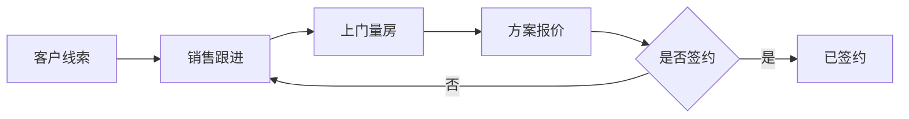
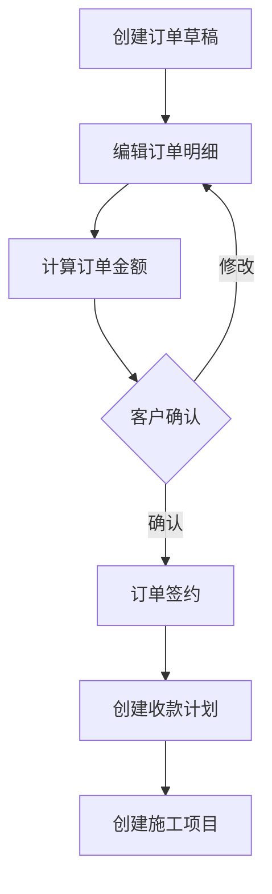
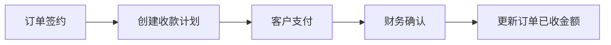
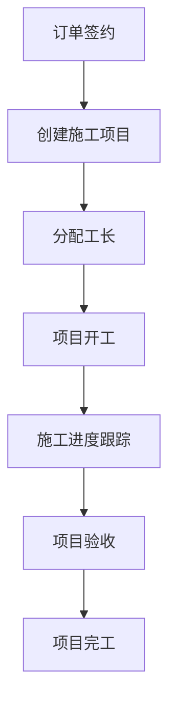

# ERP-Core 业务流程文档

> 基于装修行业的全流程 ERP 系统架构与业务闭环设计

## 📋 目录

- [系统架构](#系统架构)
- [核心实体关系](#核心实体关系)
- [业务流程](#业务流程)
- [业务闭环](#业务闭环)
- [角色与权限](#角色与权限)
- [数据字典](#数据字典)
- [关键业务规则](#关键业务规则)

---

## 🏗️ 系统架构

### 项目分层

```
┌─────────────────────────────────────────────────┐
│                  erp-code                        │  业务逻辑层（热更新）
│  ┌─────────────────────────────────────────┐   │
│  │  动态业务流程（JavaScript）              │   │
│  │  - 客户创建/审核/分配                    │   │
│  │  - 订单签约/审批/结算                    │   │
│  │  - 项目进度跟踪/验收                     │   │
│  │  - 收款确认/对账/统计                    │   │
│  │  - 业务规则计算/数据校验                 │   │
│  └─────────────────────────────────────────┘   │
└─────────────────────────────────────────────────┘
                       ↕ HTTP API
┌─────────────────────────────────────────────────┐
│                  erp-core                        │  基础设施层（稳定）
│  ┌─────────────────────────────────────────┐   │
│  │  基础服务 (NestJS + TypeScript)         │   │
│  │  - 数据库访问（TypeORM）                 │   │
│  │  - 身份认证（JWT）                       │   │
│  │  - 权限控制（RBAC）                      │   │
│  │  - 代码执行引擎（VM2）                   │   │
│  │  - 基础 CRUD 接口                        │   │
│  └─────────────────────────────────────────┘   │
└─────────────────────────────────────────────────┘
                       ↕
┌─────────────────────────────────────────────────┐
│              MySQL 8.0 数据库                   │
└─────────────────────────────────────────────────┘
```

### 设计理念

| 层次 | 技术栈 | 职责 | 优势 |
|------|--------|------|------|
| **erp-code** | JavaScript | 业务逻辑、业务规则、数据转换 | 热更新、快速迭代、无需重启 |
| **erp-core** | TypeScript + NestJS | 数据持久化、基础 CRUD、认证授权 | 性能稳定、类型安全、可靠 |

---

## 📊 核心实体关系

### ER 图

```
                    ┌───────────────┐
                    │     User      │
                    │   (用户表)     │
                    └───────┬───────┘
                            │
                    ┌───────┴───────┐
                    │               │
            ┌───────▼───────┐  ┌───▼────────┐
            │   Customer     │  │CodeFlow    │
            │   (客户表)      │  │(代码流程表) │
            └───────┬────────┘  └────────────┘
                    │
        ┌───────────┼───────────┐
        │           │           │
  ┌─────▼──────┐    │    ┌──────▼──────┐
  │CustomerFollow│   │    │   Order     │
  │ (跟进记录表) │   │    │  (订单表)    │
  └─────────────┘   │    └──────┬──────┘
                    │           │
                    │    ┌──────┴──────┬──────────┬─────────┐
                    │    │             │          │         │
                ┌───▼────▼──┐   ┌─────▼─────┐ ┌──▼─────┐ ┌▼────────┐
                │ Project   │   │OrderMaterial│ Payment │ │Material │
                │ (项目表)   │   │(订单物料表)│ (收款表)│ │(物料库) │
                └───────────┘   └────────────┘ └────────┘ └─────────┘
```

### 实体清单

| 实体 | 表名 | 说明 | 关键字段 |
|------|------|------|---------|
| **User** | `users` | 用户表 | `username`, `role`, `mobile` |
| **Customer** | `customers` | 客户信息 | `name`, `mobile`, `status`, `salesId` |
| **CustomerFollow** | `customer_follows` | 客户跟进记录 | `customerId`, `type`, `content` |
| **Order** | `orders` | 订单主表 | `orderNo`, `customerId`, `totalAmount`, `status` |
| **OrderMaterial** | `order_materials` | 订单物料明细 | `orderId`, `materialId`, `quantity`, `amount` |
| **Material** | `materials` | 物料库 | `code`, `name`, `category`, `costPrice`, `salePrice` |
| **Payment** | `payments` | 收款记录 | `paymentNo`, `orderId`, `type`, `amount`, `status` |
| **Project** | `projects` | 施工项目 | `projectNo`, `orderId`, `customerId`, `status` |
| **CodeFlow** | `code_flows` | 动态代码流程 | `key`, `name`, `code`, `category` |

---

## 🔄 业务流程

### 1️⃣ 客户获取与培育流程



#### 状态流转

```
lead（线索）→ measured（已量房）→ quoted（已报价）→ signed（已签约）→ completed（已完工）
```

#### 关键节点

| 阶段 | 操作 | 数据 | 责任人 |
|------|------|------|--------|
| **线索获取** | 创建客户 | 基本信息（姓名、电话、地址） | 销售 |
| **电话跟进** | 记录跟进 | 跟进类型：`call` | 销售 |
| **上门量房** | 记录跟进 + 更新状态 | 跟进类型：`measure`，状态→`measured` | 销售/设计师 |
| **方案报价** | 创建订单草稿 | 订单明细（主材+人工），状态→`quoted` | 设计师 |
| **签约确认** | 订单签约 | 订单状态→`signed`，记录签约时间 | 销售 |

---

### 2️⃣ 订单管理流程



#### 订单状态流转

```
draft（草稿）→ signed（已签约）→ in_progress（施工中）→ completed（已完工）/ cancelled（已取消）
```

#### 订单构成

| 组成部分 | 说明 | 数据来源 |
|---------|------|---------|
| **客户信息** | 关联客户ID | `customers` 表 |
| **订单明细** | 主材、人工、增项 | `order_materials` 表 |
| **金额计算** | 总金额、已收金额、成本金额 | 明细汇总 + 收款统计 |
| **负责人** | 销售、设计师、工长 | `users` 表 |

#### 订单明细分类

```typescript
export enum OrderItemCategory {
  MAIN = 'main',      // 主材：瓷砖、地板、橱柜等
  LABOR = 'labor',    // 人工：水电工、泥工、木工等
  ADDITION = 'addition' // 增项：追加项目
}
```

---

### 3️⃣ 收款管理流程



#### 收款类型

| 类型 | 说明 | 占比参考 | 时间节点 |
|------|------|----------|---------|
| **定金** | `deposit` | 10-20% | 签约时 |
| **合同款** | `contract` | 60-70% | 开工前 |
| **设计费** | `design_fee` | 固定金额 | 方案确认后 |
| **增项款** | `addition` | 按实际 | 增项确认后 |

#### 收款状态流转

```
pending（待确认）→ confirmed（已确认）/ cancelled（已取消）
```

---

### 4️⃣ 项目施工流程



#### 项目状态流转

```
planning（规划中）→ in_progress（施工中）→ paused（暂停）/ completed（已完工）
```

#### 关键角色

| 角色 | 职责 | 操作权限 |
|------|------|---------|
| **销售** | 客户维护、订单签约 | 创建客户、订单 |
| **设计师** | 方案设计、报价 | 编辑订单明细 |
| **工长** | 项目施工、进度管理 | 更新项目状态 |
| **财务** | 收款确认、对账 | 确认收款 |
| **管理员** | 系统管理、审批 | 全部权限 |

---

## 🔁 业务闭环

### 完整业务闭环图

```
┌──────────────────────────────────────────────────────────────┐
│                      装修业务全流程闭环                          │
└──────────────────────────────────────────────────────────────┘

1️⃣ 【客户获取】
   ↓
   线索录入 → 销售分配 → 电话跟进
   │
   ├─ 客户信息：姓名、电话、地址、来源
   ├─ 跟进记录：沟通内容、下次跟进时间
   └─ 状态：lead（线索）

2️⃣ 【需求确认】
   ↓
   上门量房 → 方案设计 → 报价确认
   │
   ├─ 客户状态：measured（已量房）→ quoted（已报价）
   ├─ 订单草稿：主材清单、人工费用
   └─ 订单金额：sum(明细金额)

3️⃣ 【合同签约】
   ↓
   客户签约 → 创建正式订单 → 制定收款计划
   │
   ├─ 订单状态：draft → signed
   ├─ 客户状态：signed（已签约）
   ├─ 收款计划：定金、合同款、尾款
   └─ 签约时间：signedAt

4️⃣ 【项目执行】
   ↓
   定金到账 → 创建项目 → 分配工长 → 项目开工
   │
   ├─ 项目创建：自动生成项目编号
   ├─ 工长分配：foremanId
   ├─ 项目状态：planning → in_progress
   └─ 订单状态：signed → in_progress

5️⃣ 【施工管理】
   ↓
   施工进度跟踪 → 增项管理 → 质量验收
   │
   ├─ 进度更新：项目状态实时同步
   ├─ 增项处理：追加订单明细 → 增加订单金额
   └─ 验收确认：项目状态 → completed

6️⃣ 【收款结算】
   ↓
   分期收款 → 财务确认 → 更新订单已收金额
   │
   ├─ 收款记录：paymentNo, type, amount
   ├─ 状态流转：pending → confirmed
   └─ 订单更新：paidAmount += amount

7️⃣ 【项目交付】
   ↓
   工程验收 → 尾款结清 → 项目完工 → 客户回访
   │
   ├─ 项目状态：completed
   ├─ 订单状态：completed
   ├─ 客户状态：completed
   └─ 完工时间：completedAt

┌──────────────────────────────────────────────────────────────┐
│                      ✅ 业务闭环完成                            │
│  客户数据 → 订单数据 → 项目数据 → 收款数据 → 全部归档          │
└──────────────────────────────────────────────────────────────┘
```

### 关键数据流转

| 阶段 | 输入 | 输出 | 触发条件 |
|------|------|------|---------|
| 线索→量房 | 客户基本信息 | 量房跟进记录 | 销售预约 |
| 量房→报价 | 量房数据 | 订单草稿（明细+金额） | 设计师出方案 |
| 报价→签约 | 订单草稿 | 正式订单 | 客户签字 |
| 签约→开工 | 正式订单 + 定金 | 施工项目 | 定金到账 |
| 开工→完工 | 项目进度 | 完工验收 | 工长确认 |
| 收款→对账 | 收款记录 | 订单已收金额 | 财务确认 |

---

## 👥 角色与权限

### 角色定义

```typescript
export enum UserRole {
  ADMIN = 'admin',        // 系统管理员
  SALES = 'sales',        // 销售
  DESIGNER = 'designer',  // 设计师
  FOREMAN = 'foreman',    // 工长
  FINANCE = 'finance',    // 财务
}
```

### 权限矩阵

| 功能模块 | 管理员 | 销售 | 设计师 | 工长 | 财务 |
|---------|-------|------|--------|------|------|
| **客户管理** | ✅ | ✅ | ❌ | ❌ | ❌ |
| 创建客户 | ✅ | ✅ | ❌ | ❌ | ❌ |
| 分配客户 | ✅ | ✅ | ❌ | ❌ | ❌ |
| 客户跟进 | ✅ | ✅ | ✅ | ❌ | ❌ |
| **订单管理** | ✅ | ✅ | ✅ | ❌ | ❌ |
| 创建订单 | ✅ | ✅ | ✅ | ❌ | ❌ |
| 编辑明细 | ✅ | ✅ | ✅ | ❌ | ❌ |
| 订单签约 | ✅ | ✅ | ❌ | ❌ | ❌ |
| **项目管理** | ✅ | ❌ | ❌ | ✅ | ❌ |
| 创建项目 | ✅ | ✅ | ❌ | ❌ | ❌ |
| 更新进度 | ✅ | ❌ | ❌ | ✅ | ❌ |
| 项目完工 | ✅ | ❌ | ❌ | ✅ | ❌ |
| **收款管理** | ✅ | ❌ | ❌ | ❌ | ✅ |
| 创建收款 | ✅ | ❌ | ❌ | ❌ | ✅ |
| 确认收款 | ✅ | ❌ | ❌ | ❌ | ✅ |
| **系统管理** | ✅ | ❌ | ❌ | ❌ | ❌ |
| 用户管理 | ✅ | ❌ | ❌ | ❌ | ❌ |
| 代码流程管理 | ✅ | ❌ | ❌ | ❌ | ❌ |

---

## 📚 数据字典

### 客户来源（customer_source）

| 值 | 标签 | 说明 |
|-------|--------|------|
| `online` | 线上推广 | 网络广告、SEO、SEM |
| `offline` | 线下活动 | 展会、地推、传单 |
| `referral` | 客户转介绍 | 老客户推荐 |
| `other` | 其他渠道 | 其他来源 |

### 收款方式（payment_method）

| 值 | 标签 | 说明 |
|-------|--------|------|
| `cash` | 现金 | 现金支付 |
| `bank_transfer` | 银行转账 | 对公/对私转账 |
| `alipay` | 支付宝 | 支付宝支付 |
| `wechat` | 微信支付 | 微信支付 |

### 物料单位（material_unit）

| 值 | 标签 | 说明 |
|-------|--------|------|
| `piece` | 个 | 按个计数 |
| `meter` | 米 | 长度单位 |
| `square_meter` | 平方米 | 面积单位 |
| `box` | 盒 | 按盒计数 |
| `set` | 套 | 按套计数 |

---

## 🔐 关键业务规则

### 1. 客户管理规则

```javascript
// 客户状态只能单向流转，不能回退
lead → measured → quoted → signed → completed

// 客户必须有负责销售
customer.salesId !== null

// 签约客户必须有设计师
if (customer.status === 'signed') {
  customer.designerId !== null
}
```

### 2. 订单管理规则

```javascript
// 订单编号自动生成
orderNo = 'ORD' + YYYYMMDD + 序号（4位）
// 示例：ORD202510300001

// 订单总金额 = 所有订单明细金额之和
order.totalAmount = sum(orderMaterials.amount)

// 订单明细金额 = 数量 × 单价
orderMaterial.amount = quantity × price

// 订单可收金额校验
order.paidAmount <= order.totalAmount
```

### 3. 项目管理规则

```javascript
// 项目编号自动生成
projectNo = 'PRJ' + YYYYMMDD + 序号（4位）
// 示例：PRJ202510300001

// 一个订单可以有多个项目（拆分施工）
order.projects.length >= 1

// 项目必须关联订单和客户
project.orderId !== null && project.customerId !== null

// 项目必须有工长
if (project.status === 'in_progress') {
  project.foremanId !== null
}
```

### 4. 收款管理规则

```javascript
// 收款单号自动生成
paymentNo = 'PAY' + YYYYMMDD + 序号（4位）
// 示例：PAY202510300001

// 收款金额必须大于0
payment.amount > 0

// 订单已收金额 = 所有已确认收款之和
order.paidAmount = sum(payments.amount where status='confirmed')

// 收款不能超过订单总额
order.paidAmount <= order.totalAmount
```

### 5. 物料管理规则

```javascript
// 物料编码自动生成
code = 'MAT' + YYYYMMDD + 序号（4位）
// 示例：MAT202510300001

// 销售价必须大于等于成本价（可配置例外）
material.salePrice >= material.costPrice

// 订单明细可以关联物料库，也可以自定义
orderMaterial.materialId // 可选
orderMaterial.materialName // 必填
```

---

## 🚀 代码流程设计

### erp-code 项目中的业务流程示例

```javascript
/**
 * @flowKey customer_create
 * @flowName 客户创建
 * @description 创建新客户并分配给当前销售
 */
const { repositories, params, user } = context;
const { customerRepository } = repositories;

// 参数校验
if (!params.name || !params.mobile) {
  throw new Error('客户姓名和手机号不能为空');
}

// 检查手机号是否已存在
const existing = await customerRepository.findOne({
  where: { mobile: params.mobile }
});
if (existing) {
  throw new Error('该手机号已被注册');
}

// 创建客户
const customer = customerRepository.create({
  ...params,
  salesId: user.id, // 自动分配给当前销售
  status: 'lead',   // 初始状态为线索
});

await customerRepository.save(customer);

return {
  success: true,
  data: customer,
  message: '客户创建成功',
};
```

### 流程调用示例

```bash
POST /api/code/run/customer_create
Authorization: Bearer <token>

{
  "params": {
    "name": "张三",
    "mobile": "13800138000",
    "address": "北京市朝阳区某某小区",
    "area": "朝阳区"
  }
}
```

---

## 📈 数据统计维度

### 客户统计

- 客户来源分布
- 客户状态分布
- 销售客户数排名
- 客户转化率（签约/总数）

### 订单统计

- 订单金额统计（日/月/年）
- 订单状态分布
- 销售业绩排名
- 客单价分析

### 项目统计

- 在施项目数
- 项目完工率
- 工长项目数排名
- 项目周期分析

### 收款统计

- 收款金额统计（日/月/年）
- 收款方式分布
- 应收账款统计
- 回款率分析

---

## 🔧 技术实现要点

### 1. 数据一致性

```typescript
// 使用事务保证数据一致性
const queryRunner = dataSource.createQueryRunner();
await queryRunner.startTransaction();

try {
  // 1. 更新订单状态
  await queryRunner.manager.update(Order, orderId, { status: 'signed' });
  
  // 2. 更新客户状态
  await queryRunner.manager.update(Customer, customerId, { status: 'signed' });
  
  // 3. 创建收款计划
  await queryRunner.manager.save(Payment, paymentPlan);
  
  await queryRunner.commitTransaction();
} catch (err) {
  await queryRunner.rollbackTransaction();
  throw err;
}
```

### 2. 权限控制

```typescript
// 使用装饰器进行权限控制
@UseGuards(RolesGuard)
@Roles(UserRole.SALES, UserRole.ADMIN)
@Post('customers')
async createCustomer(@Body() dto: CreateCustomerDto) {
  // ...
}
```

### 3. 动态代码执行

```typescript
// erp-core 提供代码执行引擎
POST /api/code/run/:flowKey

// erp-code 上传业务代码
POST /api/code/upload
Headers: x-access-secret: <密钥>
```

---

## 📝 总结

本系统通过 **erp-core（基础设施）+ erp-code（业务逻辑）** 的分层架构，实现了：

✅ **完整的业务闭环**：从客户获取→订单签约→项目施工→收款结算→项目交付  
✅ **灵活的权限体系**：基于角色的精细化权限控制  
✅ **稳定的数据结构**：规范化的数据库设计，支持复杂业务场景  
✅ **动态的业务逻辑**：热更新代码，无需重启服务  
✅ **清晰的职责分工**：不同角色各司其职，协同完成业务流程  

---

**文档版本**: v1.0  
**最后更新**: 2025-10-30  
**维护人员**: ERP 开发团队

