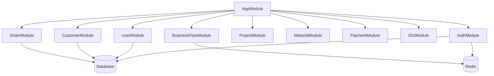
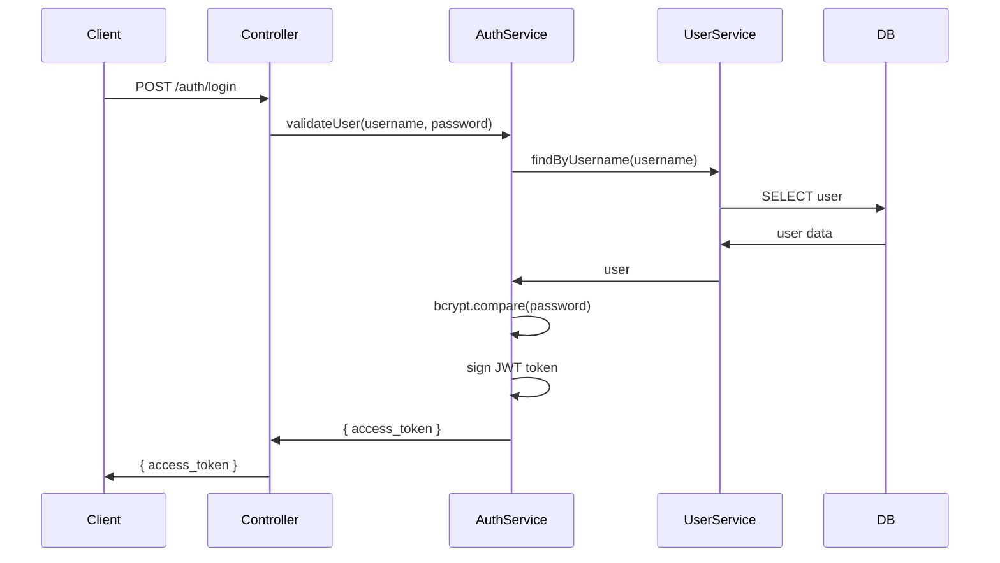

# erp-core - 技术架构

> **最后更新**: 2025-12-01

## 📊 项目概述

erp-core 是 ERP 系统的后端服务，基于 NestJS 框架构建，提供 REST API 接口，支持客户、订单、项目、物料等核心业务功能。

### 核心特性

- ✅ TypeScript 类型安全
- ✅ 模块化架构设计
- ✅ TypeORM 对象关系映射
- ✅ JWT 认证授权
- ✅ Swagger API 文档
- ✅ 动态业务流程引擎
- ✅ Redis 缓存支持

---

## 🏗️ 技术栈

| 技术 | 版本 | 用途 |
|------|------|------|
| **NestJS** | 11.0+ | 后端框架 |
| **TypeScript** | 5.7+ | 开发语言 |
| **TypeORM** | 0.3.27 | ORM 框架 |
| **MySQL** | 8.0 | 关系数据库 |
| **Redis** | 7+ | 缓存和会话 |
| **Passport** | - | 认证中间件 |
| **JWT** | 11.0+ | 令牌认证 |
| **Swagger** | 11.2+ | API 文档 |
| **Axios** | 1.13+ | HTTP 客户端 |
| **Bcrypt** | 3.0+ | 密码加密 |

---

## 📁 项目结构

```
erp-core/
├── src/
│   ├── main.ts                 # 应用入口
│   ├── app.module.ts           # 根模块
│   ├── common/                 # 公共模块
│   │   ├── decorators/        # 装饰器
│   │   ├── filters/           # 异常过滤器
│   │   ├── guards/            # 守卫
│   │   ├── interceptors/      # 拦截器
│   │   └── pipes/             # 管道
│   ├── config/                 # 配置模块
│   │   └── configuration.ts
│   ├── database/               # 数据库配置
│   │   ├── data-source.ts
│   │   └── migrations/
│   ├── modules/                # 业务模块
│   │   ├── auth/              # 认证授权
│   │   ├── user/              # 用户管理
│   │   ├── customer/          # 客户管理
│   │   ├── order/             # 订单管理
│   │   ├── project/           # 项目管理
│   │   ├── material/          # 物料管理
│   │   ├── payment/           # 财务管理
│   │   ├── company/           # 公司管理
│   │   ├── dict/              # 字典管理
│   │   ├── business-flow/     # 业务流程引擎
│   │   └── upload/            # 文件上传
│   └── entities/               # 实体定义（可选，通常在模块内）
├── test/                       # 测试文件
├── migrations/                 # 数据库迁移
├── scripts/                    # 工具脚本
├── Dockerfile                  # Docker 构建
├── docker-compose.prod.yml     # 生产环境配置
├── .env                        # 开发环境变量
├── .env.prod                   # 生产环境变量
└── nest-cli.json               # NestJS CLI 配置
```

---

## 🎯 架构设计

### 分层架构

```
┌─────────────────────────────────────┐
│         API Layer (Controllers)      │  HTTP 请求处理
├─────────────────────────────────────┤
│      Business Layer (Services)       │  业务逻辑
├─────────────────────────────────────┤
│     Data Layer (Repositories)        │  数据访问
├─────────────────────────────────────┤
│        Database (MySQL/Redis)        │  数据存储
└─────────────────────────────────────┘
```

### 模块架构



### 依赖注入

NestJS 使用依赖注入模式：

```typescript
@Module({
  imports: [TypeOrmModule.forFeature([Customer])],
  controllers: [CustomerController],
  providers: [CustomerService],
  exports: [CustomerService],
})
export class CustomerModule {}

@Injectable()
export class CustomerService {
  constructor(
    @InjectRepository(Customer)
    private customerRepository: Repository<Customer>,
  ) {}
}
```

---

## 🔒 认证授权

### JWT 认证流程



### Guard 守卫

```typescript
// JWT 守卫
@Injectable()
export class JwtAuthGuard extends AuthGuard('jwt') {}

// 使用守卫保护路由
@Controller('customers')
@UseGuards(JwtAuthGuard)
export class CustomerController {
  @Get()
  findAll() {
    // 只有携带有效 JWT 的请求才能访问
  }
}
```

---

## 💼 核心业务模块

### 客户管理 (Customer)

**实体设计**:

```typescript
@Entity()
export class Customer {
  @PrimaryGeneratedColumn()
  id: number;

  @Column()
  name: string;

  @Column({ nullable: true })
  phone: string;

  @Column({
    type: 'enum',
    enum: ['线索', '量房', '报价', '签约', '完工'],
  })
  status: string;

  @ManyToOne(() => User)
  @JoinColumn({ name: 'created_by' })
  createdBy: User;

  @OneToMany(() => Order, order => order.customer)
  orders: Order[];
}
```

**Service 层**:

```typescript
@Injectable()
export class CustomerService {
  constructor(
    @InjectRepository(Customer)
    private repository: Repository<Customer>,
  ) {}

  async findAll(params: any) {
    return await this.repository.find({
      relations: ['createdBy', 'orders'],
      where: params,
    });
  }
}
```

### 订单管理 (Order)

**关键功能**:
- 订单CRUD
- 状态流转 (草稿→签约→施工→完工)
- 物料关联
- 金额计算

**数据关系**:
```
Order 1:N OrderMaterial
Order N:1 Customer
Order 1:N Project
Order 1:N Payment
```

### 业务流程引擎 (BusinessFlow)

**设计理念**: 动态执行业务逻辑

```typescript
@Injectable()
export class BusinessFlowService {
  async runFlow(flowKey: string, context: any) {
    // 1. 从数据库获取流程代码
    const flow = await this.findByKey(flowKey);
    
    // 2. 注入依赖（repositories, 参数, 用户信息）
    const flowContext = {
      repositories: this.buildRepositories(),
      params: context.params,
      user: context.user,
    };
    
    // 3. 执行流程代码
    const func = new Function('context', flow.code);
    const result = await func(flowContext);
    
    return result;
  }
}
```

---

## 📝 数据库设计

### TypeORM 配置

```typescript
// database/data-source.ts
export const AppDataSource = new DataSource({
  type: 'mysql',
  host: process.env.DB_HOST,
  port: +process.env.DB_PORT,
  username: process.env.DB_USERNAME,
  password: process.env.DB_PASSWORD,
  database: process.env.DB_DATABASE,
  entities: [__dirname + '/../**/*.entity{.ts,.js}'],
  migrations: [__dirname + '/migrations/*{.ts,.js}'],
  synchronize: false,  // 生产环境必须关闭
  logging: process.env.NODE_ENV === 'development',
});
```

### Migration 流程

```bash
# 生成 migration
pnpm migration:generate src/migrations/AddCustomerTable

# 运行 migration
pnpm migration:run

# 回滚 migration
pnpm migration:revert
```

### 核心实体关系

``typescript
// 一对多关系
@Entity()
export class Customer {
  @OneToMany(() => Order, order => order.customer)
  orders: Order[];
}

@Entity()
export class Order {
  @ManyToOne(() => Customer, customer => customer.orders)
  @JoinColumn({ name: 'customer_id' })
  customer: Customer;
}
```

---

## 🚀 API 设计

### RESTful 规范

| Method | Path | 说明 |
|--------|------|------|
| GET | /api/customers | 获取客户列表 |
| GET | /api/customers/:id | 获取客户详情 |
| POST | /api/customers | 创建客户 |
| PUT | /api/customers/:id | 更新客户 |
| DELETE | /api/customers/:id | 删除客户 |

### 响应格式

```typescript
// 成功响应
{
  "success": true,
  "data": { ... },
  "message": "操作成功"
}

// 错误响应
{
  "success": false,
  "message": "错误信息",
  "error": "ERROR_CODE"
}
```

### Swagger 文档

```typescript
@Controller('customers')
@ApiTags('客户管理')
export class CustomerController {
  @Get()
  @ApiOperation({ summary: '获取客户列表' })
  @ApiResponse({ status: 200, description: '成功' })
  findAll() {}
}
```

---

## 🔧 配置管理

### 环境变量

```env
# .env (开发环境)
NODE_ENV=development
PORT=3009

DB_HOST=localhost
DB_PORT=3306
DB_USERNAME=root
DB_PASSWORD=root
DB_DATABASE=erp_core
DB_SYNCHRONIZE=true

REDIS_HOST=localhost
REDIS_PORT=6379
REDIS_PASSWORD=redis123

JWT_SECRET=dev_secret_key
JWT_EXPIRES_IN=7d
```

### ConfigModule

```typescript
@Module({
  imports: [
    ConfigModule.forRoot({
      isGlobal: true,
      envFilePath: `.env.${process.env.NODE_ENV}`,
    }),
  ],
})
export class AppModule {}
```

---

## 📊 性能优化

### 数据库查询优化

```typescript
// ❌ N+1 查询
const orders = await orderRepository.find();
for (const order of orders) {
  order.customer = await customerRepository.findOne(order.customerId);
}

// ✅ 使用 relations 一次查询
const orders = await orderRepository.find({
  relations: ['customer', 'materials'],
});

// ✅ 使用 QueryBuilder 复杂查询
const orders = await orderRepository
  .createQueryBuilder('order')
  .leftJoinAndSelect('order.customer', 'customer')
  .where('customer.status = :status', { status: '签约' })
  .getMany();
```

### Redis 缓存

```typescript
@Injectable()
export class DictService {
  constructor(
    @InjectRedis() private readonly redis: Redis,
  ) {}

  async getDictByType(type: string) {
    const cacheKey = `dict:${type}`;
    const cached = await this.redis.get(cacheKey);
    
    if (cached) {
      return JSON.parse(cached);
    }
    
    const data = await this.repository.find({ where: { type } });
    await this.redis.setex(cacheKey, 3600, JSON.stringify(data));
    
    return data;
  }
}
```

---

## 🧪 测试

### 单元测试

```typescript
describe('CustomerService', () => {
  let service: CustomerService;

  beforeEach(async () => {
    const module = await Test.createTestingModule({
      providers: [CustomerService],
    }).compile();

    service = module.get<CustomerService>(CustomerService);
  });

  it('should find all customers', async () => {
    const result = await service.findAll({});
    expect(result).toBeDefined();
  });
});
```

### E2E 测试

```bash
pnpm test:e2e
```

---

## 📚 相关文档

- [部署架构](./部署架构.md)
- [优化建议](./优化建议.md)
- [NestJS 官方文档](https://docs.nestjs.com/)
- [TypeORM 官方文档](https://typeorm.io/)

---

**架构设计: 简洁、可维护、可扩展** 🏗️
