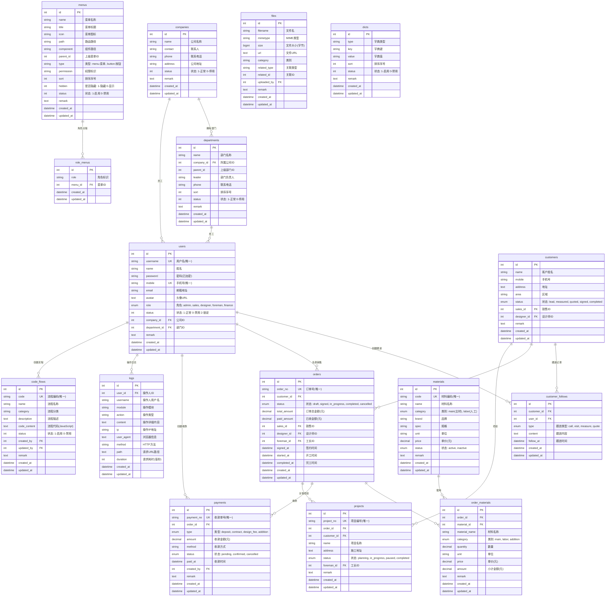

# ERP Core 数据库表关系图

## 核心表结构（16张表）



## 业务流程说明

### 1. 客户管理流程
```
客户录入(lead) → 量房(measured) → 报价(quoted) → 签约(signed) → 完工(completed)
    ↓            ↓                ↓              ↓             ↓
customer_follows 记录每个阶段的跟进情况
```

### 2. 订单流程
```
创建订单(draft) → 签约(signed) → 施工中(in_progress) → 完工(completed)
    ↓               ↓               ↓                    ↓
  报价单         定金/合同款      增项款               尾款
                   (payments表)
```

### 3. 组织架构
```
公司(companies) → 部门(departments) → 用户(users)
                      ↓
                  可设置上级部门，支持树形结构
```

### 4. 权限管理
```
角色(UserRole枚举) → role_menus → menus
                        ↓
                   动态菜单权限分配
```

### 5. 操作审计
```
所有关键操作 → 记录到 logs 表
    ↓
包含：操作人、模块、动作、IP、耗时等
```

## 核心索引

### 唯一索引
- `users.username`
- `users.mobile`
- `materials.code`
- `orders.order_no`
- `payments.payment_no`
- `projects.project_no`
- `code_flows.code`

### 普通索引
- `departments.company_id`
- `users.(company_id, department_id)`
- `menus.(parent_id, sort)`
- `role_menus.(role, menu_id)`
- `customers.(mobile, status, sales_id)`
- `orders.(customer_id, status)`
- `order_materials.(order_id, material_id)`
- `payments.(order_id, status)`
- `projects.(order_id, status)`
- `dicts.(type, status)`
- `logs.(user_id, module, action)`
- `code_flows.(category, status)`

## 新增表说明

### menus - 菜单表
- 支持树形结构（parent_id）
- type 区分菜单和按钮权限
- permission 用于API权限控制

### role_menus - 角色菜单关联表
- 通过 role 字段关联角色
- 实现角色到菜单的多对多关系
- 灵活配置不同角色的菜单权限

### logs - 操作日志表
- 记录所有关键操作
- 用于审计和问题追溯
- 包含完整的请求信息（IP、耗时等）
